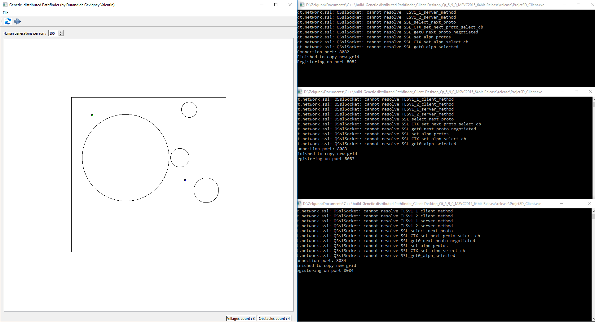
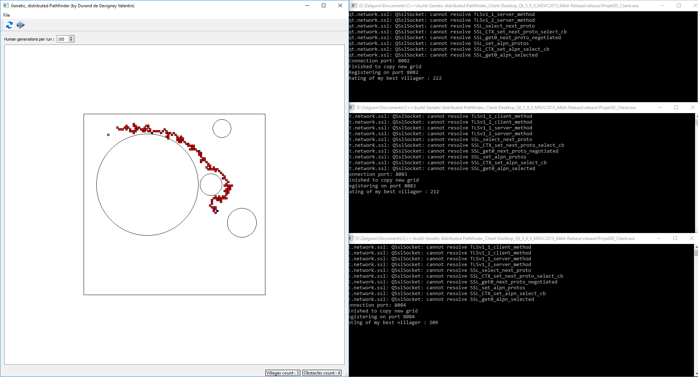
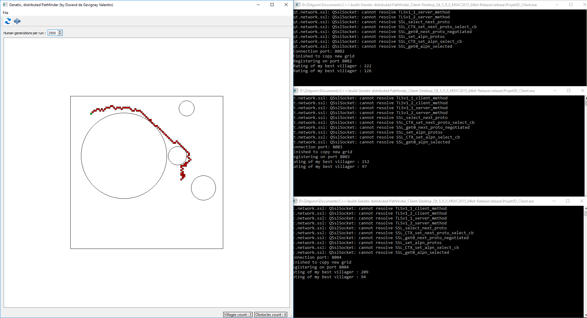

# Genetic distributed Pathfinder

## Table of contents
[The game](#the-game)  
[Genetic algorithms](#genetic-algorithms)  
[Screenshots](#screenshots)  
[Requierements](#requierements)  

The aim of this project is not effeciency, pathfinders based on A* and Dijkstra are way better for this.  
The goal here is to provide a fairly simple case for Genetic algorithms.  
Also, the project uses RPC (Remote Procedure Call) to distribute work load over several clients.
Note that clients can be started on the same computer, allowing you to use more than one core.
You can also only use one client if you want to.

## The "game"
The game happens on a square grid. There is an enter gate and an exit gate, villagers must find the best path to go from the entrance to the exit.
One to five obstacles are present on the grid, if a villager enters one of them, he will "die".  
There are also as many villages as there are clients connected to the server. Sometimes, some villagers will move to an other village.

## Genetic algorithms
- DNA  
	Villagers' DNA is made of directions, there are 8 differents directions (East, North-East, North, and so on...).  
	When a villager is tested on the grid, his DNS is used to determine where he will go. By default, a villager's DNA contains 200 directions so they will make 200 steps (unless they die in an obstacle).
	Villagers from the first generation have a completely random DNA.
	
- Rating  
	A villager is rated according to 3 parameters :
	- Number of steps (is equal to DNA's length if the villager doesn't reach the exit)
	- Distance between exit and final position (is 0 if the villager reaches the exit)
	- Health (if the villager dies, his rating increases a lot but no too much)
	The goal for a villager is to have the lowest rating possible.
	
- Breeding  
	Breeding happens for each generation. Villagers are sorted according to their ratings, the top 50% stays alive while the rest dies.
	Survivors then breed, giving birth to new villagers, doubling the amount of villagers (restoring the original count).
	
	The DNA of a newborne is made by associating the parents' DNA, with some mutations :
		1) A number "i" (between 0 and the length of the DNA) is randomly generated
		2) Newborne's DNA : [FirstParent 1, FirstParent 2, ..., FirstParent i-1, SecondParent i, ... SecondParent N]
		3) 2% of directions in the newborne's DNA then mutate, shifting to one the two adjacent directions.
	It is important to keep the mutation rate low (2% here), if the percentage is too high, the pathfinder may never converge.
	
- Population exchanges  
	Sometimes, villages will exchange villagers. This helps prevent villages from "falling" into a local minimum.  
	For example, if there are two ways to the exit and one of the village only know the first one, a villager coming from an other village may "teach" them abouth the second one, which may be better.
	Exchanges are rare, if we were to exchange villagers too often then all the villages would behave as one and they could again "fall" into a local minimum.
	Note that this is also the goal of Mutation but at a bigger scale.
	
## Screenshots
- Initialization

- After 100 generations

- After 2600 generations : the path is way better !

## Requierements

- [Qt](https://www.qt.io/)
- [LibMaia](https://github.com/wiedi/libmaia)